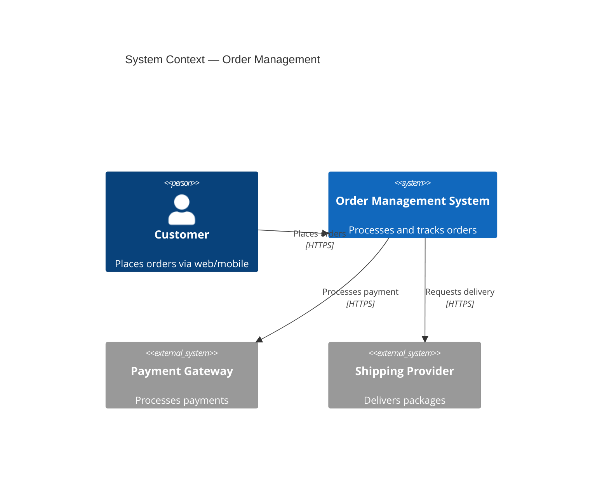
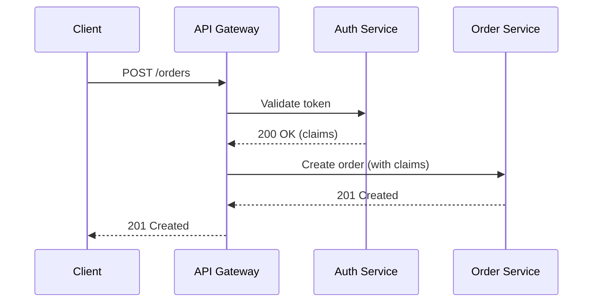
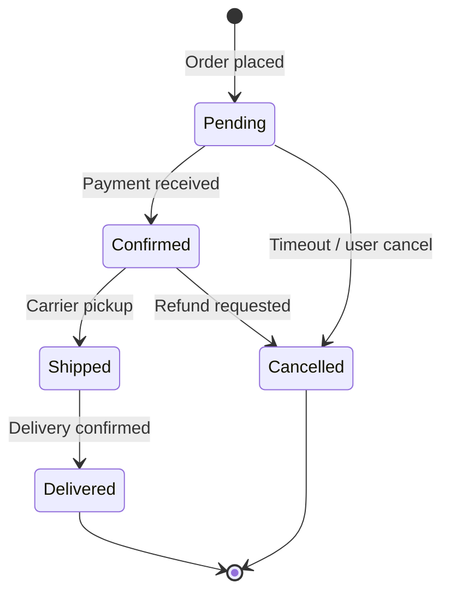
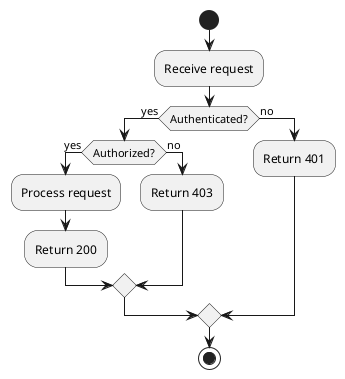

# Metapowers Phase 1: Curated Skills Expansion — Implementation Plan

> **For agentic workers:** REQUIRED SUB-SKILL: Use superpowers:subagent-driven-development (recommended) or superpowers:executing-plans to implement this plan task-by-task. Steps use checkbox (`- [ ]`) syntax for tracking.

**Goal:** Deliver the 5 highest-value skills/rules that fill the biggest ecosystem gaps: software-architecture, security-review, tech-writing, diagramming, and product-discipline.

**Architecture:** Each item is a SSOT skill or rule in `skills/<name>/SKILL.md` (or `RULE.md`). Two items use the umbrella pattern (rule + skill pair sharing a directory name — separate directories for each kind). All content must pass `upskill lint --strict` and `upskill fmt`.

**Tech Stack:** Markdown with YAML frontmatter (upskill portable format), validated by `upskill lint`, formatted by `upskill fmt` and `dprint`.

---

## File Structure

```text
skills/
├── software-architecture/
│   ├── RULE.md              # Always-loaded architectural invariants
│   └── SKILL.md             # On-demand: pattern selection, trade-off analysis
├── security-review/
│   └── SKILL.md             # OWASP, injection, auth, secrets, supply chain
├── tech-writing/
│   └── SKILL.md             # Diataxis, ADRs, API docs, changelogs, prose clarity
├── diagramming/
│   └── SKILL.md             # Mermaid, PlantUML, draw.io, C4, diagram selection
├── product-discipline/
│   ├── RULE.md              # Always-loaded: AC required, issue hierarchy, prioritization
│   └── SKILL.md             # On-demand: framework selection, backlog grooming
└── metapowers.bundle.yaml   # Updated to include new items
```

---

## Task 1: software-architecture RULE.md

**Files:**
- Create: `skills/software-architecture/RULE.md`

- [ ] **Step 1: Scaffold the rule**

Run: `upskill new rule software-architecture`

- [ ] **Step 2: Write the rule content**

The rule must encode always-applicable architectural invariants. Content:

```markdown
---
schema: 1
name: software-architecture
description: Architectural invariants — failure isolation, explicit contracts, data ownership
version: 0.1.0
---

# Software Architecture

## Invariants

These principles apply to every architectural decision. Violating them requires
explicit justification in an ADR.

### 1. Single Responsibility at Service Boundaries

Every service, module, or bounded context owns exactly one business capability.
If you cannot name what a component is responsible for in one sentence, it is
doing too much.

### 2. Explicit Contracts Between Components

All inter-component communication uses explicitly defined contracts:
- API schemas (OpenAPI, protobuf, GraphQL SDL)
- Event schemas (CloudEvents, Avro, JSON Schema)
- Shared-nothing: no shared databases, no shared mutable state

Never rely on implicit knowledge of another component's internals.

### 3. Failure Isolation (Bulkhead Pattern)

A failure in component A must not cascade to component B unless B explicitly
depends on A's output. Design for:
- Timeouts on all external calls
- Circuit breakers on repeated failures
- Fallback behavior (degraded mode, cached response, or explicit error)
- Supervision: crashed components restart without manual intervention

### 4. Data Ownership

Every piece of data has exactly one authoritative source. Other components may
cache or project that data, but the owner is the only writer. Ask:
- Who creates this data?
- Who is allowed to mutate it?
- Who is the source of truth when copies diverge?

### 5. Async by Default at Integration Points

Synchronous calls between services create temporal coupling. Prefer:
- Events/messages for notifications and state propagation
- Request/reply only when the caller cannot proceed without the response
- Idempotent consumers (at-least-once delivery is the baseline assumption)

### 6. Evolutionary Architecture

Design for change, not for prediction:
- Prefer reversible decisions over optimal ones
- Record irreversible decisions in ADRs with context and consequences
- Fitness functions: define measurable criteria (latency p99, coupling metrics,
  deployment frequency) and monitor them

## When to load the software-architecture skill

Load the `software-architecture` skill when:
- Designing a new system or subsystem from scratch
- Evaluating trade-offs between architectural patterns
- Facing a decision that affects multiple components
- Writing or reviewing an ADR
```

- [ ] **Step 3: Validate**

Run: `upskill lint skills/software-architecture/RULE.md --strict`
Expected: 0 findings

- [ ] **Step 4: Format**

Run: `upskill fmt`
Expected: 0 files changed (already canonical)

- [ ] **Step 5: Commit**

```bash
git add skills/software-architecture/RULE.md
git commit -m "feat: add software-architecture rule — architectural invariants"
```

---

## Task 2: software-architecture SKILL.md

**Files:**
- Create: `skills/software-architecture/SKILL.md`

- [ ] **Step 1: Scaffold the skill**

Run: `upskill new skill software-architecture`

Note: the directory already exists from Task 1. The scaffold should detect the
existing RULE.md and create SKILL.md alongside it. If it refuses, create
manually.

- [ ] **Step 2: Write the skill content**

```markdown
---
schema: 1
name: software-architecture
description: Pattern selection, trade-off analysis, and architectural decision-making
version: 0.1.0
---

# Software Architecture

## When to use this skill

Use when facing architectural decisions: choosing patterns, evaluating
trade-offs, designing system boundaries, or writing ADRs.

## Process

### 1. Identify the Decision

Before choosing a pattern, name the decision explicitly:
- What capability are we adding or changing?
- What quality attributes matter most? (latency, throughput, consistency,
  availability, maintainability, cost)
- What constraints exist? (team size, timeline, existing infrastructure,
  compliance)

### 2. Evaluate Patterns

For each candidate pattern, assess:

| Criterion | Questions |
|-----------|-----------|
| Fitness | Does it optimize for the quality attributes that matter? |
| Complexity | Can the team operate it? What's the cognitive load? |
| Reversibility | How hard is it to migrate away if it's wrong? |
| Precedent | Is there prior art in this codebase or organization? |

### 3. Common Patterns — Decision Tree

**Data flow:**
- Request/response needed? → REST, gRPC, GraphQL
- Fire-and-forget notification? → Events (Kafka, NATS, SQS)
- Need to replay history? → Event Sourcing
- Need different read/write models? → CQRS

**Component structure:**
- Single team, single deploy? → Modular monolith
- Multiple teams, independent deploy? → Microservices
- Complex domain logic? → Domain-Driven Design (load `domain-driven-design` skill)
- High throughput, back-pressure needed? → Reactive (load `reactive-systems` skill)
- Long-running multi-step process? → Saga / orchestration (load `event-driven-architecture` skill)

**Resilience:**
- External dependency unreliable? → Circuit breaker + fallback
- Need to survive partial failures? → Bulkhead isolation
- Need consistency across services? → Saga with compensation

### 4. Record the Decision

Every irreversible architectural decision gets an ADR:

```markdown
# NNNN — [Decision Title]

## Status: [Proposed | Accepted | Deprecated | Superseded by NNNN]

## Context
[What forces are at play? What constraints exist?]

## Decision
[What did we decide? Be specific.]

## Consequences
[What becomes easier? What becomes harder? What risks remain?]
```

### 5. Validate with Fitness Functions

After implementing, define measurable criteria:
- Latency: p50, p95, p99 targets
- Coupling: number of cross-service synchronous calls
- Autonomy: can each service deploy independently?
- Resilience: what happens when dependency X is down for 5 minutes?

## Expert Skills

For deeper guidance on specific patterns:
- **Domain-Driven Design** → `domain-driven-design` skill
- **Event Sourcing / CQRS / Sagas** → `event-driven-architecture` skill
- **Reactive Manifesto / Back-pressure** → `reactive-systems` skill
```

- [ ] **Step 3: Validate**

Run: `upskill lint skills/software-architecture/SKILL.md --strict`
Expected: 0 findings

- [ ] **Step 4: Format**

Run: `upskill fmt`
Expected: 0 files changed

- [ ] **Step 5: Commit**

```bash
git add skills/software-architecture/SKILL.md
git commit -m "feat: add software-architecture skill — pattern selection and trade-off analysis"
```

---

## Task 3: security-review SKILL.md

**Files:**
- Create: `skills/security-review/SKILL.md`

- [ ] **Step 1: Scaffold**

Run: `upskill new skill security-review`

- [ ] **Step 2: Write the skill content**

```markdown
---
schema: 1
name: security-review
description: Systematic security review — OWASP, injection, auth, secrets, supply chain
version: 0.1.0
---

# Security Review

## When to use this skill

Use when reviewing code for security vulnerabilities, designing authentication
or authorization, handling secrets, or auditing dependencies.

## Review Checklist

### 1. Injection (OWASP A03)

**Check for:**
- SQL: parameterized queries only, never string concatenation
- Command injection: no `shell=True`, no unsanitized user input in commands
- XSS: output encoding, CSP headers, no `dangerouslySetInnerHTML` without sanitization
- Template injection: no user input in template expressions
- Path traversal: canonicalize paths, reject `..`, validate against allowlist

**Pattern:**
```
User input → Validation → Sanitization → Parameterized API
Never: User input → String interpolation → Execution
```

### 2. Authentication & Authorization (OWASP A01, A07)

**Check for:**
- Authentication bypass: every endpoint has auth middleware unless explicitly public
- Broken access control: authorization checked at the resource level, not just the route
- Session management: secure flags, httpOnly, SameSite, rotation on privilege change
- Password storage: bcrypt/scrypt/argon2 only, never MD5/SHA-1/SHA-256 alone
- MFA: supported for privileged operations
- JWT: verify signature, check expiration, validate issuer and audience

**Questions to ask:**
- Can user A access user B's data by changing an ID in the URL?
- What happens if the auth token is expired but cached?
- Is there a rate limit on login attempts?

### 3. Secrets Management (OWASP A02)

**Never:**
- Hardcoded secrets in source code
- Secrets in environment variables without rotation strategy
- Secrets in logs (mask/redact)
- Secrets in error messages returned to clients
- Secrets committed to git (even if later removed — history persists)

**Always:**
- Use a secrets manager (Vault, AWS Secrets Manager, GCP Secret Manager)
- Rotate secrets on a schedule
- Audit secret access
- Use short-lived tokens over long-lived keys

**Detection:** Search for patterns: `password=`, `secret=`, `api_key=`,
`token=`, base64-encoded strings, high-entropy strings in config files.

### 4. Data Exposure (OWASP A01)

**Check for:**
- API responses returning more fields than the client needs
- Error messages exposing stack traces, SQL queries, or internal paths
- Logs containing PII, tokens, or request bodies
- Debug endpoints enabled in production

**Pattern:** Explicit allowlist of fields in API responses. Never serialize
entire domain objects to the wire.

### 5. Supply Chain (OWASP A06)

**Check for:**
- Dependency versions pinned (lockfile committed)
- Known vulnerabilities (`npm audit`, `cargo audit`, `pip-audit`)
- Typosquatting: verify package names match official sources
- Minimal dependencies: each dependency is justified
- No `postinstall` scripts from untrusted packages

### 6. Cryptography

**Never:**
- Roll your own crypto
- Use ECB mode
- Use MD5 or SHA-1 for security purposes
- Reuse nonces/IVs
- Use random number generators that aren't cryptographically secure

**Always:**
- AES-256-GCM or ChaCha20-Poly1305 for symmetric encryption
- RSA-OAEP or ECDH for asymmetric
- HKDF for key derivation
- Use well-audited libraries (libsodium, ring, Web Crypto API)

## Severity Classification

| Severity | Definition | Action |
|----------|-----------|--------|
| Critical | Exploitable without authentication, data breach likely | Block merge, fix immediately |
| High | Exploitable with low-privilege access | Block merge, fix in this PR |
| Medium | Requires specific conditions to exploit | Fix before release |
| Low | Defense-in-depth improvement | Track as debt |

## Output Format

When performing a security review, report findings as:

```
## Security Findings

### [CRITICAL/HIGH/MEDIUM/LOW] — [Title]
**Location:** `file:line`
**Issue:** [What's wrong]
**Impact:** [What an attacker could do]
**Fix:** [Specific remediation]
```
```

- [ ] **Step 3: Validate**

Run: `upskill lint skills/security-review/SKILL.md --strict`
Expected: 0 findings

- [ ] **Step 4: Format**

Run: `upskill fmt`
Expected: 0 files changed

- [ ] **Step 5: Commit**

```bash
git add skills/security-review/SKILL.md
git commit -m "feat: add security-review skill — OWASP, injection, auth, secrets, supply chain"
```

---

## Task 4: tech-writing SKILL.md

**Files:**
- Create: `skills/tech-writing/SKILL.md`

- [ ] **Step 1: Scaffold**

Run: `upskill new skill tech-writing`

- [ ] **Step 2: Write the skill content**

```markdown
---
schema: 1
name: tech-writing
description: Technical writing craft — Diataxis, ADRs, API docs, changelogs, prose clarity
version: 0.1.0
---

# Technical Writing

## When to use this skill

Use when writing documentation, ADRs, changelogs, API references, READMEs, or
any prose that developers will read.

## The Diataxis Framework

Every piece of documentation serves one of four purposes. Don't mix them.

| Type | Purpose | Oriented to | Example |
|------|---------|-------------|---------|
| **Tutorial** | Learning | Doing (guided) | "Build your first API" |
| **How-to** | Accomplishing | Doing (goal) | "How to add authentication" |
| **Explanation** | Understanding | Thinking (why) | "Why we chose event sourcing" |
| **Reference** | Information | Thinking (what) | "API endpoint specification" |

**Common mistake:** Mixing tutorial content with reference content. A tutorial
says "type this command." A reference says "this command accepts these flags."
They serve different readers at different moments.

## Prose Principles

### 1. Active Voice

| Bad | Good |
|-----|------|
| The request is validated by the middleware | The middleware validates the request |
| Errors are logged by the service | The service logs errors |
| The configuration file is read at startup | The application reads configuration at startup |

### 2. Front-Load Information

Put the most important information first. The reader may stop at any point.

| Bad | Good |
|-----|------|
| After considering various approaches and evaluating trade-offs, we decided to use gRPC | We chose gRPC for service communication |
| In order to ensure that the system maintains consistency... | The system maintains consistency by... |

### 3. One Idea Per Sentence

If a sentence has "and" or "but" joining two independent clauses, split it.

### 4. Concrete Over Abstract

| Bad | Good |
|-----|------|
| The system handles errors appropriately | The system retries transient errors 3 times with exponential backoff, then returns a 503 |
| Performance is acceptable | p99 latency is under 200ms at 1000 RPS |

### 5. Consistent Terminology

Pick one term and use it everywhere. Create a glossary if needed.
Never: "user" in one paragraph, "customer" in the next, "account holder" later.

## Document Types

### ADR (Architecture Decision Record)

```markdown
# NNNN — [Title: Verb Phrase]

## Status
[Proposed | Accepted | Deprecated | Superseded by NNNN]

## Context
[2-5 sentences: what forces exist, what constraints apply, what triggered this]

## Decision
[1-3 sentences: what we will do, stated clearly]

## Consequences
### Positive
- [What becomes easier]

### Negative
- [What becomes harder]

### Risks
- [What could go wrong]
```

### Changelog Entry

Follow Keep a Changelog format:
- **Added** for new features
- **Changed** for changes in existing functionality
- **Deprecated** for soon-to-be removed features
- **Removed** for now removed features
- **Fixed** for any bug fixes
- **Security** for vulnerability fixes

Each entry: imperative mood, one line, issue/PR reference.

### API Documentation

For each endpoint:
1. Method + path
2. One-sentence description
3. Request (headers, params, body with example)
4. Response (status codes, body with example)
5. Error cases (status code + error body)
6. Authentication requirement

### README Structure

1. **Title + one-line description** (what is this?)
2. **Quick start** (how do I use it in 30 seconds?)
3. **Installation** (how do I get it?)
4. **Usage** (common patterns)
5. **Configuration** (what can I change?)
6. **Contributing** (how do I help?)
7. **License**

## Quality Checklist

Before publishing any documentation:
- [ ] Does it serve exactly one Diataxis purpose?
- [ ] Is the audience explicit? (developer, operator, end-user)
- [ ] Can someone follow it without asking clarifying questions?
- [ ] Are all code examples tested/runnable?
- [ ] Is terminology consistent with the glossary?
- [ ] Is it findable? (linked from relevant places, good title)
```

- [ ] **Step 3: Validate**

Run: `upskill lint skills/tech-writing/SKILL.md --strict`
Expected: 0 findings

- [ ] **Step 4: Format**

Run: `upskill fmt`
Expected: 0 files changed

- [ ] **Step 5: Commit**

```bash
git add skills/tech-writing/SKILL.md
git commit -m "feat: add tech-writing skill — Diataxis, ADRs, API docs, prose clarity"
```

---

## Task 5: diagramming SKILL.md

**Files:**
- Create: `skills/diagramming/SKILL.md`

- [ ] **Step 1: Scaffold**

Run: `upskill new skill diagramming`

- [ ] **Step 2: Write the skill content**

```markdown
---
schema: 1
name: diagramming
description: Architecture and design diagrams — Mermaid, PlantUML, draw.io, C4, format selection
version: 0.1.0
---

# Diagramming

## When to use this skill

Use when creating or reviewing architecture diagrams, sequence diagrams, state
machines, or any visual representation of system design.

## Format Selection

| Format | Best for | Pros | Cons |
|--------|----------|------|------|
| **Mermaid** | Inline in Markdown, GitHub rendering | Version-controlled, renders in PRs, simple syntax | Limited layout control, no custom styling |
| **PlantUML** | Complex UML, detailed sequence diagrams | Full UML support, extensive styling | Requires renderer, verbose syntax |
| **draw.io** | Collaborative editing, complex layouts | WYSIWYG, export to SVG/PNG, editable XML | Binary-ish XML, merge conflicts, not inline |
| **SVG** | Final publication, precise control | Scalable, embeddable, full styling | Manual editing painful, not semantic |

**Decision rule:**
- Living documentation in a repo? → **Mermaid** (renders in GitHub/GitLab)
- Formal UML for stakeholders? → **PlantUML**
- Collaborative whiteboarding? → **draw.io**
- Published/printed output? → **SVG** (often exported from above)

## Diagram Types — When to Use What

| Question you're answering | Diagram type |
|---------------------------|-------------|
| What are the major components and how do they relate? | C4 Context / Container |
| How do components interact for a specific flow? | Sequence diagram |
| What states can this entity be in? | State machine |
| What steps does this process follow? | Activity / flowchart |
| How is data structured? | Entity-relationship (ER) |
| How do classes/modules relate? | Class diagram |
| How is the system deployed? | Deployment diagram |

## C4 Model (Recommended for Architecture)

Four levels of zoom:

1. **Context** — system + external actors (people, other systems)
2. **Container** — applications, data stores, message brokers within the system
3. **Component** — major structural blocks within a container
4. **Code** — class/module level (rarely needed in docs)

**Rule:** Start at Context. Only zoom in when the audience needs it.

### Mermaid C4 Example



## Sequence Diagrams

Use for: showing how components interact over time for a specific scenario.

### Mermaid Sequence Example



### Principles

- **Left to right = time flow.** Initiator on the left.
- **Name participants by role**, not implementation (`Auth Service`, not `auth-svc-v2`)
- **One scenario per diagram.** Don't cram happy path + error cases in one.
- **Show async with dotted arrows** (`-->>` in Mermaid)

## State Machines

Use for: entities with lifecycle (orders, payments, deployments, user accounts).

### Mermaid State Example



### Principles

- **Every state is a noun** (Pending, not "waiting for payment")
- **Every transition is a verb/event** (Payment received, not "goes to confirmed")
- **Include terminal states** — where does the lifecycle end?
- **Show error/cancel paths** — not just the happy path

## PlantUML Examples

### Activity Diagram



## Layout Principles

1. **Flow direction:** Top-to-bottom or left-to-right. Never mix.
2. **Reduce crossings:** Reorder elements to minimize crossing lines.
3. **Group related elements:** Use boxes/boundaries to show logical grouping.
4. **Label everything:** Every arrow needs a label. Unlabeled arrows are ambiguous.
5. **Color with purpose:** Use color to encode meaning (e.g., red = external, blue = internal), not decoration.
6. **Keep it simple:** If a diagram has more than 7±2 elements at one level, zoom in.

## Quality Checklist

- [ ] Does the diagram answer exactly one question?
- [ ] Can someone unfamiliar with the system understand it in 30 seconds?
- [ ] Are all arrows labeled?
- [ ] Is the notation consistent? (don't mix UML and informal boxes)
- [ ] Is it version-controlled? (text format preferred over binary)
- [ ] Does it match the current system? (stale diagrams are worse than none)
```

- [ ] **Step 3: Validate**

Run: `upskill lint skills/diagramming/SKILL.md --strict`
Expected: 0 findings

- [ ] **Step 4: Format**

Run: `upskill fmt`
Expected: 0 files changed

- [ ] **Step 5: Commit**

```bash
git add skills/diagramming/SKILL.md
git commit -m "feat: add diagramming skill — Mermaid, PlantUML, C4, format selection"
```

---

## Task 6: product-discipline RULE.md

**Files:**
- Create: `skills/product-discipline/RULE.md`

- [ ] **Step 1: Scaffold**

Run: `upskill new rule product-discipline`

- [ ] **Step 2: Write the rule content**

```markdown
---
schema: 1
name: product-discipline
description: Product ownership invariants — acceptance criteria, issue hierarchy, prioritization
version: 0.1.0
---

# Product Discipline

## Invariants

These rules apply to all product/backlog work. They ensure traceability,
clarity, and disciplined prioritization.

### 1. Every Story Has Acceptance Criteria

No story enters a sprint or gets assigned without explicit acceptance criteria.
Acceptance criteria are:
- Written in Given/When/Then or checklist format
- Testable (an engineer can write a test from them)
- Complete (cover happy path + key error cases)

A story without AC is a wish, not a requirement.

### 2. Issue Hierarchy Is Enforced

```
Initiative (label only)
  → Epic (issue + labels)
    → Story (user-facing requirement)
    → Task (technical requirement)
    → Debt (refactoring / review findings)
```

- Every story/task/debt links to its parent epic
- Epics link to their initiative
- No orphan issues — everything traces to business value

### 3. Prioritization Is Explicit

Every item has:
- **Severity** (K0: must-have, K1: should-fix, K2: nice-to-have)
- **Effort** (XS, S, M, L, XL)
- **Priority** (derived from severity × effort matrix)

Never prioritize by gut feel alone. The matrix exists to make trade-offs
visible and debatable.

### 4. One Deliverable Per Issue

An issue describes one thing to build, fix, or improve. If it requires the
word "and" to describe, split it.

### 5. Definition of Done

An issue is done when:
- Code is merged to main
- Tests pass (unit + integration + acceptance)
- Documentation is updated (if behavior changed)
- The acceptance criteria are demonstrably met

"Done" is not "code written." Done is "value delivered and verified."

## When to load the product-discipline skill

Load the `product-discipline` skill when:
- Grooming or refining a backlog
- Prioritizing work across competing demands
- Defining acceptance criteria for a new feature
- Choosing a prioritization framework (RICE, MoSCoW, severity×effort)
```

- [ ] **Step 3: Validate**

Run: `upskill lint skills/product-discipline/RULE.md --strict`
Expected: 0 findings

- [ ] **Step 4: Format**

Run: `upskill fmt`
Expected: 0 files changed

- [ ] **Step 5: Commit**

```bash
git add skills/product-discipline/RULE.md
git commit -m "feat: add product-discipline rule — AC, issue hierarchy, prioritization invariants"
```

---

## Task 7: product-discipline SKILL.md

**Files:**
- Create: `skills/product-discipline/SKILL.md`

- [ ] **Step 1: Scaffold**

Run: `upskill new skill product-discipline`

- [ ] **Step 2: Write the skill content**

```markdown
---
schema: 1
name: product-discipline
description: Product ownership techniques — prioritization frameworks, backlog grooming, issue modeling
version: 0.1.0
---

# Product Discipline

## When to use this skill

Use when grooming backlogs, prioritizing competing work, writing acceptance
criteria, or helping a PO structure their workflow.

## Prioritization Frameworks

### Severity × Effort Matrix

```
          XS    S     M     L     XL
K0     P0    P0    P0    P1    P1
K1     P0    P1    P1    P2    drop
K2     P1    P2    P2    drop  drop
```

- **P0:** Do immediately (current sprint)
- **P1:** Plan for next sprint
- **P2:** Backlog (do when capacity allows)
- **drop:** Not worth the investment — close or park

### RICE Scoring

```
Score = (Reach × Impact × Confidence) / Effort
```

| Factor | Scale |
|--------|-------|
| Reach | Number of users/events per quarter |
| Impact | 0.25 (minimal), 0.5 (low), 1 (medium), 2 (high), 3 (massive) |
| Confidence | 0.5 (low), 0.8 (medium), 1.0 (high) |
| Effort | Person-weeks |

Use RICE when comparing unrelated initiatives. Use severity×effort when
triaging within a known domain.

### MoSCoW

- **Must have:** System doesn't work without it
- **Should have:** Important but workaround exists
- **Could have:** Nice to have, low effort
- **Won't have (this time):** Explicitly out of scope

Use MoSCoW for release scoping. Not for sprint planning.

## Writing Acceptance Criteria

### Given/When/Then Format

```gherkin
Given [precondition / initial state]
When [action / trigger]
Then [expected outcome / observable result]
```

**Rules:**
- One behavior per scenario
- Preconditions are explicit (not assumed)
- Outcomes are observable (not internal state)
- Cover: happy path, validation failure, edge case, authorization

### Example

```gherkin
Feature: Password reset

Scenario: Successful reset
  Given a registered user with email "user@example.com"
  When they request a password reset
  Then they receive a reset email within 60 seconds
  And the reset link expires after 24 hours

Scenario: Unregistered email
  Given no user exists with email "unknown@example.com"
  When someone requests a password reset for that email
  Then no email is sent
  And the response is identical to the success case (no information leak)
```

## Issue Types

| Type | Purpose | Required fields |
|------|---------|-----------------|
| **Epic** | Groups related work toward a business goal | Goal, success metrics, child issues |
| **Story** | User-facing requirement | AC (Given/When/Then), epic link, severity, effort |
| **Task** | Technical requirement | Description, epic link, severity, effort |
| **Debt** | Refactoring or review finding | Origin (PR/review), epic link, severity, effort |
| **Bug** | Defect in existing behavior | Repro steps, expected vs actual, severity, effort |

## Expert Skills

For deeper guidance on specific techniques:
- **Acceptance Test-Driven Development** → `atdd` skill
- **Domain discovery workshops** → `event-storming` skill
- **Release planning and slicing** → `story-mapping` skill
- **User journey analysis** → `cuj-analysis` skill
- **Issue hierarchy and triage** → `issue-modeling` skill
```

- [ ] **Step 3: Validate**

Run: `upskill lint skills/product-discipline/SKILL.md --strict`
Expected: 0 findings

- [ ] **Step 4: Format**

Run: `upskill fmt`
Expected: 0 files changed

- [ ] **Step 5: Commit**

```bash
git add skills/product-discipline/SKILL.md
git commit -m "feat: add product-discipline skill — prioritization, AC writing, issue types"
```

---

## Task 8: Update metapowers.bundle.yaml

**Files:**
- Modify: `skills/metapowers.bundle.yaml`

- [ ] **Step 1: Update the bundle manifest**

Replace the current content with:

```yaml
schema: 1
name: metapowers
description: Curated starter pack — architecture, safety, domain expertise, documentation, and product discipline
license: MIT
items:
  rules:
    - karpathy-guidelines
    - software-architecture
    - product-discipline
  skills:
    - software-architecture
    - security-review
    - tech-writing
    - diagramming
    - product-discipline
requires:
  - name: superpowers
metadata:
  version: 0.2.0
```

- [ ] **Step 2: Validate bundle**

Run: `upskill lint --strict`
Expected: 0 findings (all referenced items exist)

- [ ] **Step 3: Format**

Run: `upskill fmt`
Expected: 0 files changed

- [ ] **Step 4: Commit**

```bash
git add skills/metapowers.bundle.yaml
git commit -m "feat: update metapowers bundle to v0.2.0 — Phase 1 skills"
```

---

## Task 9: Final validation

- [ ] **Step 1: Full lint pass**

Run: `upskill lint --strict`
Expected: 0 findings across all items

- [ ] **Step 2: Full fmt pass**

Run: `upskill fmt`
Expected: 0 files changed

- [ ] **Step 3: Markdown lint**

Run: `just lint`
Expected: 0 errors

- [ ] **Step 4: Push and create PR**

```bash
git push -u origin feat/phase-1-curated-skills
gh pr create --title "feat: Phase 1 curated skills — architecture, security, docs, product" \
  --body "## Summary

Adds 7 items (5 skills + 2 rules) across 5 directories:
- \`software-architecture\` (rule + skill) — architectural invariants and pattern selection
- \`security-review\` (skill) — OWASP, injection, auth, secrets, supply chain
- \`tech-writing\` (skill) — Diataxis, ADRs, API docs, prose clarity
- \`diagramming\` (skill) — Mermaid, PlantUML, C4, format selection
- \`product-discipline\` (rule + skill) — AC, prioritization, issue modeling

Updates \`metapowers.bundle.yaml\` to v0.2.0.

## Test Plan
- [ ] \`upskill lint --strict\` passes
- [ ] \`upskill fmt\` is idempotent
- [ ] \`just lint\` passes
- [ ] Bundle installs cleanly in a fresh repo"
```
