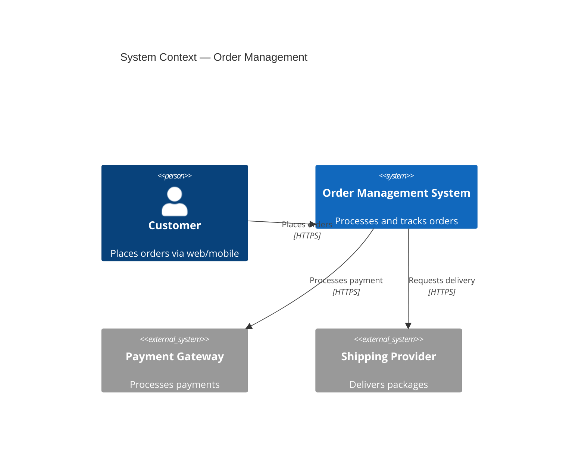
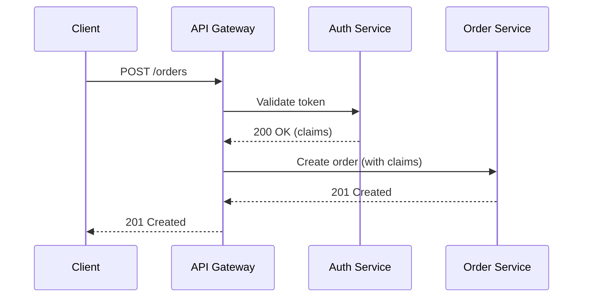
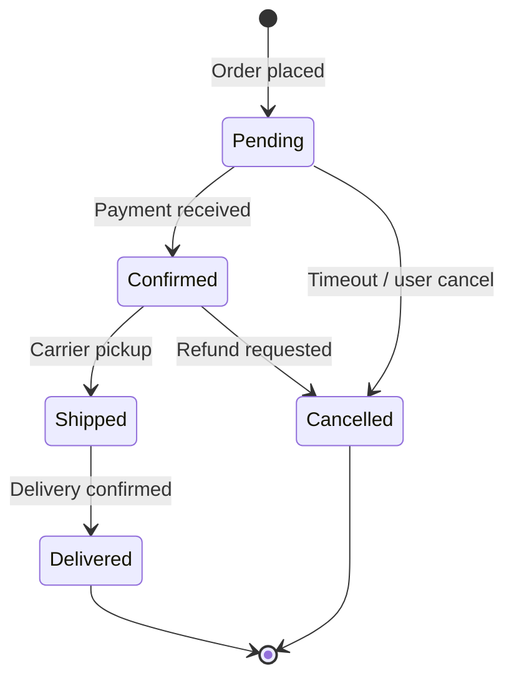
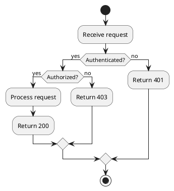

## When to use this skill

Use when creating or reviewing architecture diagrams, sequence diagrams, state
machines, or any visual representation of system design.

## Format Selection

| Format       | Best for                                | Pros                                              | Cons                                        |
| ------------ | --------------------------------------- | ------------------------------------------------- | ------------------------------------------- |
| **Mermaid**  | Inline in Markdown, GitHub rendering    | Version-controlled, renders in PRs, simple syntax | Limited layout control, no custom styling   |
| **PlantUML** | Complex UML, detailed sequence diagrams | Full UML support, extensive styling               | Requires renderer, verbose syntax           |
| **draw.io**  | Collaborative editing, complex layouts  | WYSIWYG, export to SVG/PNG, editable XML          | Binary-ish XML, merge conflicts, not inline |
| **SVG**      | Final publication, precise control      | Scalable, embeddable, full styling                | Manual editing painful, not semantic        |

**Decision rule:**

- Living documentation in a repo? → **Mermaid** (renders in GitHub/GitLab)
- Formal UML for stakeholders? → **PlantUML**
- Collaborative whiteboarding? → **draw.io**
- Published/printed output? → **SVG** (often exported from above)

## Diagram Types — When to Use What

| Question you're answering                             | Diagram type             |
| ----------------------------------------------------- | ------------------------ |
| What are the major components and how do they relate? | C4 Context / Container   |
| How do components interact for a specific flow?       | Sequence diagram         |
| What states can this entity be in?                    | State machine            |
| What steps does this process follow?                  | Activity / flowchart     |
| How is data structured?                               | Entity-relationship (ER) |
| How do classes/modules relate?                        | Class diagram            |
| How is the system deployed?                           | Deployment diagram       |

## C4 Model (Recommended for Architecture)

Four levels of zoom:

1. **Context** — system + external actors (people, other systems)
2. **Container** — applications, data stores, message brokers within the system
3. **Component** — major structural blocks within a container
4. **Code** — class/module level (rarely needed in docs)

**Rule:** Start at Context. Only zoom in when the audience needs it.

### Mermaid C4 Example

## Sequence Diagrams

Use for: showing how components interact over time for a specific scenario.

### Mermaid Sequence Example

### Principles

- **Left to right = time flow.** Initiator on the left.
- **Name participants by role**, not implementation (`Auth Service`, not `auth-svc-v2`)
- **One scenario per diagram.** Don't cram happy path + error cases in one.
- **Show async with dotted arrows** (`-->>` in Mermaid)

## State Machines

Use for: entities with lifecycle (orders, payments, deployments, user accounts).

### Mermaid State Example

### Principles

- **Every state is a noun** (Pending, not "waiting for payment")
- **Every transition is a verb/event** (Payment received, not "goes to confirmed")
- **Include terminal states** — where does the lifecycle end?
- **Show error/cancel paths** — not just the happy path

## PlantUML Examples

### Activity Diagram

## Layout Principles

1. **Flow direction:** Top-to-bottom or left-to-right. Never mix.
2. **Reduce crossings:** Reorder elements to minimize crossing lines.
3. **Group related elements:** Use boxes/boundaries to show logical grouping.
4. **Label everything:** Every arrow needs a label. Unlabeled arrows are ambiguous.
5. **Color with purpose:** Use color to encode meaning (e.g., red = external, blue = internal), not decoration.
6. **Keep it simple:** If a diagram has more than 7±2 elements at one level, zoom in.

## Quality Checklist (diagrams)

- [ ] Does the diagram answer exactly one question?
- [ ] Can someone unfamiliar with the system understand it in 30 seconds?
- [ ] Are all arrows labeled?
- [ ] Is the notation consistent? (don't mix UML and informal boxes)
- [ ] Is it version-controlled? (text format preferred over binary)
- [ ] Does it match the current system? (stale diagrams are worse than none)
